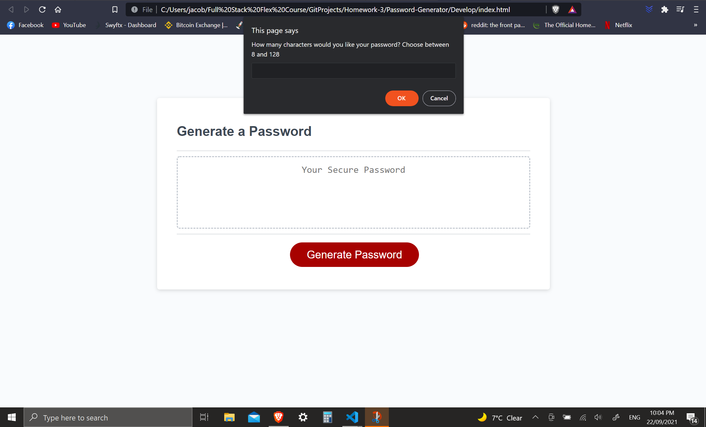
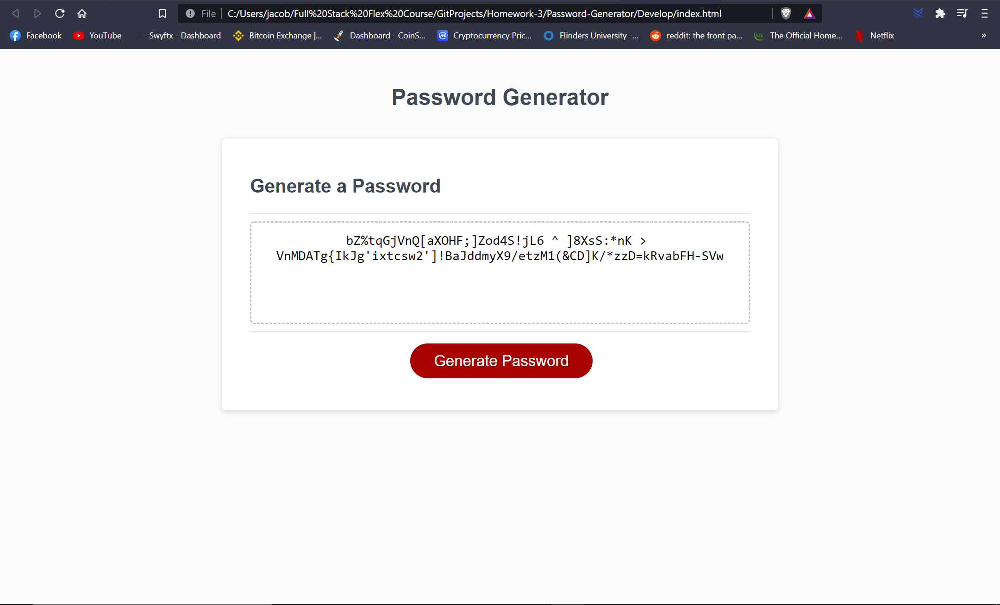
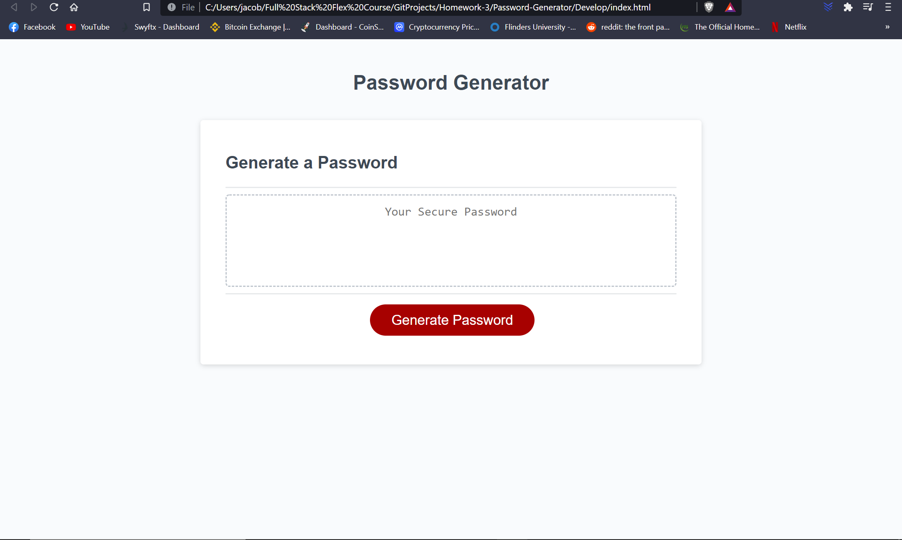

# Password-Generator

This project was designed as a homework assignment for Adelaide University's full sack flex course boot camp.

This application utilises Javascript to generate a random, secure password for the user. 

This project has been deployed to GitHub Pages. To get this project up and running, you can follow the deployment link. Or, download the sources files to use this as a template.

## Getting Started

This project has been deployed to GitHub Pages. To get this project up and running, you can follow the deployment link. Or, download the sources files to use this as a template.

* [GitHub Repository](https://github.com/JCONSTANT112/Password-Generator.git)
* [Deployed GitHub IO](https://jconstant112.github.io/Password-Generator/)

### Prerequisites

To install this application, you will need a text editor. I recommend Visual Studio Code. 

### Installing

To install this code, download the zip file, or use GitHub's guidelines to clone the repository. 

### Summary
* HTML and CSS and Javascript documents create a random password generator 
* This project utilises Javascript to make dynamic changes to an HMTL document

### This project has the following features: 
* A generate button
    * This will send the user a series of prompts and confirms
    * After user data is collected, a random password will be generated using Javascript

# 
    
# 
    
# 

### Code and Project Requirements: 
* The user will be prompted to choose from the following password criteria: 8 and 128 characters
* The user will be asked to to choose from the following:
Lowercase letters, Uppercase letters, numbers and special characters.
The app must then generate a password in the textbox within the requested parameters. 

## Authors

* Jacob Constantinidis

## Acknowledgments

* Youtube, google and Adelaide University for answers/tips and advice.

